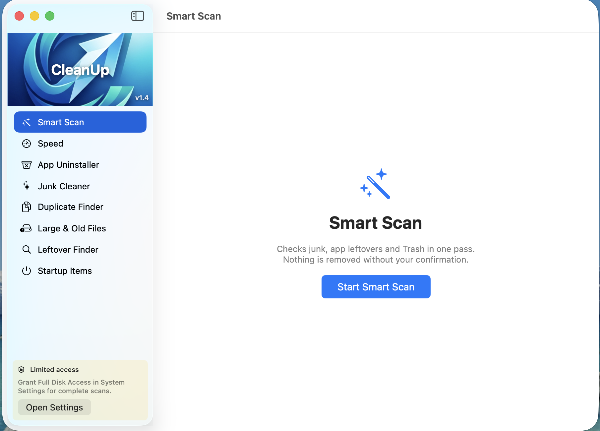

# CleanUp

**A free, open-source Mac cleaner with no snake oil.**

Native Swift + SwiftUI. Tiny footprint. Everything it removes goes to the **Trash** — never permanently deleted — always behind a confirmation. No subscription, no upsell, no fake "RAM optimizer".



## Features

- 🪄 **Smart Scan** — one click checks junk, app leftovers and Trash, shows how much you can reclaim, and cleans it in one action.
- ⏱ **Speed** — an honest performance toolkit:
  - Health check: disk headroom, memory pressure (swap), startup items, uptime — with traffic-light status and one-click fixes
  - Live CPU & memory hogs with a polite Quit
  - Reversible interface-animation tweaks (labeled honestly: they *feel* faster, they don't add horsepower)
  - Maintenance: flush DNS, restart Finder/Dock, re-index a folder in Spotlight
- 🗑 **App Uninstaller** — removes an app *and* its leftovers: Application Support, Caches, Preferences, Containers, Launch Agents, saved state.
- ✨ **Junk Cleaner** — user caches, logs, Xcode junk, developer caches (npm, pip, Homebrew, Gradle…), browser caches, old iOS backups, Trash.
- 📄 **Duplicate Finder** — exact duplicates via size → partial hash → full SHA-256. Zero false positives.
- 💾 **Large & Old Files** — everything over 50 MB with last-opened dates.
- 🔍 **Leftover Finder** — orphaned files from apps you deleted long ago (Apple's own files always excluded).
- ⚡️ **Startup Items** — see launch agents and daemons; switch your own agents off and on again, fully reversibly.
- 📊 **Menu bar widget** — live CPU, memory and disk usage, launch-at-login toggle, one-click Smart Scan.

## What CleanUp will never do

- ❌ "Free up RAM" buttons — macOS manages memory correctly on its own; purging makes things slower.
- ❌ Claim cache-clearing speeds up your Mac — we clear caches to reclaim *space* and say so.
- ❌ Permanently delete anything — Trash only, restore anytime.
- ❌ Phone home — no analytics, no network calls, nothing leaves your Mac.

## Install

### Download (easiest)

1. Grab the latest `CleanUp-x.y.zip` from [Releases](https://github.com/syahrul84/cleanUp/releases)
2. Unzip and move `CleanUp.app` to `/Applications`
3. First launch: **right-click → Open → Open** (the app is not yet notarized by Apple)
   - If macOS still refuses: `xattr -dr com.apple.quarantine /Applications/CleanUp.app`
4. Recommended: grant **Full Disk Access** (System Settings → Privacy & Security) so scans can see everything

Requires macOS 14 (Sonoma) or newer.

### Build from source

Only Apple's Command Line Tools needed (`xcode-select --install`) — no Xcode:

```sh
git clone https://github.com/syahrul84/cleanUp.git
cd cleanUp
./build_app.sh
cp -R dist/CleanUp.app /Applications/
```

## Safety model

Every removal uses `FileManager.trashItem` — files move to the Trash and can be restored. Every clean action shows a confirmation with the exact list first. Risky categories (iOS backups, Trash contents, orphan candidates) are never pre-selected.

## Support this project ♥

CleanUp is free and always will be. If it saved you some gigabytes:

- ⭐️ **Star this repo** — it genuinely helps others find the app
- 💖 **[Sponsor on GitHub](https://github.com/sponsors/syahrul84)**
- ☕️ Tell a friend, file a bug, or send a PR

## License

[MIT](LICENSE) © 2026 Syahrul Farhan
