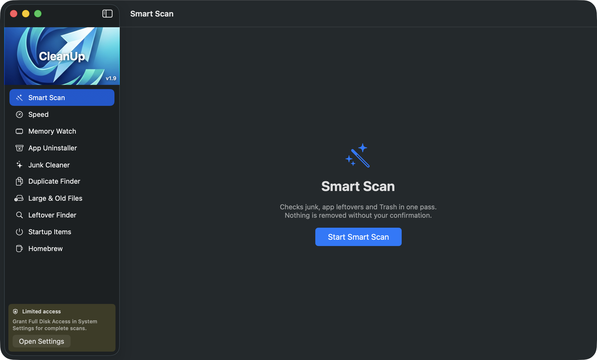
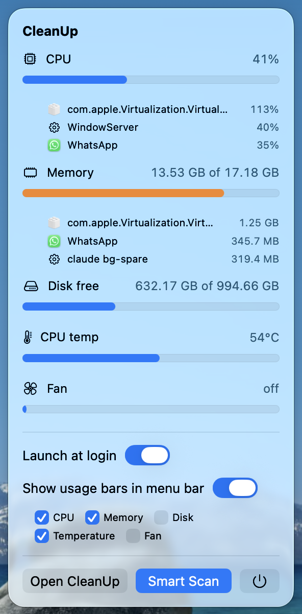

# CleanUp

**A free, open-source Mac cleaner with no snake oil.**

Native Swift + SwiftUI. Tiny footprint. Everything it removes goes to the **Trash** — never permanently deleted — always behind a confirmation. No subscription, no upsell, no fake "RAM optimizer".



<p align="center">
  
</p>

## Features

- 🪄 **Smart Scan** — one click checks junk, app leftovers and Trash, shows how much you can reclaim, and cleans it in one action.
- ⏱ **Speed** — an honest performance toolkit:
  - Health check: disk headroom, memory pressure (macOS's real pressure level, not leftover swap), startup items, uptime — with traffic-light status and one-click fixes
  - Live CPU & memory hogs with a polite Quit
  - Reversible interface-animation tweaks (labeled honestly: they *feel* faster, they don't add horsepower)
  - Maintenance: flush DNS, restart Finder/Dock, remove unavailable simulators, re-index a folder in Spotlight
- 🧠 **Memory Watch** — live memory footprint of every running app with per-app alert levels. When an app crosses your level (hello, browser tabs), a notification offers one-click Quit or Relaunch. Honest by design: macOS can't hard-cap an app's RAM, so we alert instead of pretending.
- 🗑 **App Uninstaller** — removes an app *and* its leftovers: Application Support, Caches, Preferences, Containers, Launch Agents, saved state. Shows each app's size and when you last used it, sortable by name, size or last used — so big, forgotten apps stand out.
- ✨ **Junk Cleaner** — user caches, logs, Xcode junk (DerivedData, device support, SwiftUI previews, simulator caches — Archives never pre-selected), developer caches (npm, pip, Homebrew, Gradle, SwiftPM…), browser caches, old iOS backups, Trash.
- 📄 **Duplicate Finder** — exact duplicates via size → partial hash → full SHA-256. Zero false positives.
- 💾 **Large & Old Files** — everything over 50 MB with last-opened dates.
- 🔍 **Leftover Finder** — orphaned files from apps you deleted long ago. Deliberately cautious: data belonging to helpers inside installed apps, shared group containers and anything from the same developer as an installed app is never flagged, and Apple's own files are always excluded.
- ⚡️ **Startup Items** — see launch agents and daemons; switch your own agents off and on again, fully reversibly.
- 🫥 **Menu Bar organizer** — declutter your menu bar, Hidden Bar-style: ⌘-drag icons you rarely need to the left of CleanUp's separator, then hide and show them with one click on the chevron. Optional auto-hide timer and start-hidden setting. No extra permissions needed.
- 🍺 **Homebrew** — reclaim brew's cached downloads, remove orphaned dependencies, update outdated apps and CLI tools (with live output), and uninstall packages with their sizes. **Adopt** apps you installed by hand so Homebrew keeps them updated, and **Discover** popular apps to install the maintainable way. Hides itself if Homebrew isn't installed.
- 📊 **Menu bar widget** — live CPU, memory, disk, **CPU temperature (with macOS's official thermal state) and fan speed**, plus the top CPU- and memory-hungry processes, launch-at-login toggle, one-click Smart Scan. Optional live usage bars as the menu bar icon (green = low, blue = normal, red = high) — only for sensors your Mac actually has, so fanless Macs never show a fan.

## What CleanUp will never do

- ❌ "Free up RAM" buttons — macOS manages memory correctly on its own; purging makes things slower.
- ❌ Claim cache-clearing speeds up your Mac — we clear caches to reclaim *space* and say so.
- ❌ Permanently delete anything — Trash only, restore anytime.
- ❌ Phone home — no analytics or tracking. Network use is limited to checking GitHub Releases for updates and, only when you open the Homebrew tab, downloading Homebrew's public app catalog and each app's icon from its own website.

## Install

### Download (easiest)

1. Grab the latest `CleanUp-x.y.zip` from [Releases](https://github.com/syahrul84/cleanUp/releases)
2. Unzip and move `CleanUp.app` to `/Applications`
3. First launch: **right-click → Open → Open** (the app is not yet notarized by Apple)
   - If macOS still refuses: `xattr -dr com.apple.quarantine /Applications/CleanUp.app`
4. Recommended: grant **Full Disk Access** (System Settings → Privacy & Security) so scans can see everything

Requires macOS 14 (Sonoma) or newer. Universal binary — runs natively on both Apple Silicon and Intel Macs.

### Build from source

Requires **Xcode** (free from the App Store). Command Line Tools alone can't build current SwiftUI code:

```sh
git clone https://github.com/syahrul84/cleanUp.git
cd cleanUp
./build_app.sh
cp -R dist/CleanUp.app /Applications/
```

## Safety model

Every removal uses `FileManager.trashItem` — files move to the Trash and can be restored. Every clean action shows a confirmation with the exact list first. Risky categories (iOS backups, Trash contents, orphan candidates) are never pre-selected.

## Support this project ♥

CleanUp is free and always will be. If it saved you some gigabytes:

- ⭐️ **Star this repo** — it genuinely helps others find the app
- ☕️ **[Buy me a coffee on Ko-fi](https://ko-fi.com/syahrul84)**
- 🐛 Tell a friend, file a bug, or send a PR

## License

[MIT](LICENSE) © 2026 Syahrul Farhan
